<div align="center">



<br/>

[](https://www.linkedin.com/in/eduardo-souza-rodrigues/)
[](https://eduardo2580.github.io/)
[](https://orcid.org/0009-0001-7877-2153)
[](https://lattes.cnpq.br/2487835899987366)
[](mailto:edu.rodrigues2580@gmail.com)

</div>

---

```yaml
name     : Eduardo Souza Rodrigues
location : Campinas, SP 🇧🇷
role     : Junior Developer
education:
  - ADS — Universidade São Francisco (2024–)
  - Técnico em Informática — SENAC (2022–2023)  🏆 Projeto do Ano
focus    : Web · ServiceNow · AI Agents · Android Studio
contact  : edu.rodrigues2580@gmail.com
```

---

## Stack

**Web** — `HTML` `CSS` `JavaScript` `Bootstrap` `Node.js`

**Backend** — `C#` `.NET` `Python` `Java`

**Data & Tools** — `MySQL` `Git` `GitHub` `VS Code` `Visual Studio`

**Platforms** — `ServiceNow` `Android Studio` `Unity` `Arduino` `Construct 3`

---

## Stats

<div align="center">


<br/>


</div>

---

## Projects

| Project | Tech | Link |
|---------|------|------|
| 🌐 **Portfolio** | HTML · CSS · JS | [eduardo2580.github.io →](https://eduardo2580.github.io/) |
| 🔮 **O Futuro do Trabalho** *(2023 — Projeto do Ano)* | HTML · CSS · JS · Bootstrap · VLibras | [View →](https://github.com/eduardo2580/EMED_SENAC/tree/main/SchoolYearProject2023) |
| 💣 **Campo Minado** | Web | [View →](https://github.com/eduardo2580) |
| 🌿 **Legalização da Maconha** *(2022)* | HTML · CSS | [View →](https://github.com/eduardo2580/EMED_SENAC/tree/main/SchoolYearProject2022) |

---

## Certifications

<details>
<summary>🏫 University of Michigan — Web Design for Everybody (2023)</summary>
<br>

HTML5 · CSS3 · JavaScript Interactivity · Responsive Design · Web Design Capstone — all completed.
</details>

<details>
<summary>⚡ ServiceNow (2023–2024)</summary>
<br>

Shark Bootcamp #4 · Shark Bootcamp #8 (15h) · Cask Camp (20h) · Intro to Generative AI — Now Learning
</details>

<details>
<summary>🤖 AI & Data — Alura (2024–2026)</summary>
<br>

Google Gemini Immersion (4h) · Back-End Immersion (4h) · Python Data Immersion (4h) · AI Agents Immersion (4h)
</details>

<details>
<summary>📱 Mobile & Fundamentals — Fundação Bradesco / SENAC</summary>
<br>

Android Studio (15h) · IT Fundamentals (7h) · OOP ×2 (5h) · HTML+CSS+JS site (2h) · Computer Support Technician — SENAC (272h)
</details>

---

<div align="center">

<picture>
  <source media="(prefers-color-scheme: dark)"  srcset="https://raw.githubusercontent.com/eduardo2580/eduardo2580/output/github-contribution-grid-snake-dark.svg">
  <source media="(prefers-color-scheme: light)" srcset="https://raw.githubusercontent.com/eduardo2580/eduardo2580/output/github-contribution-grid-snake.svg">
  
</picture>

<sub>© 2023–2026 Eduardo Souza Rodrigues · Campinas, SP 🇧🇷</sub>

</div>
