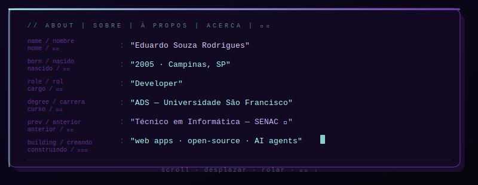
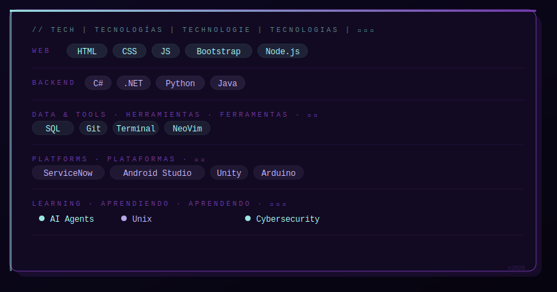
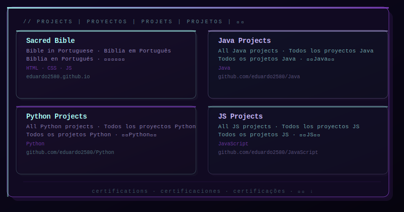
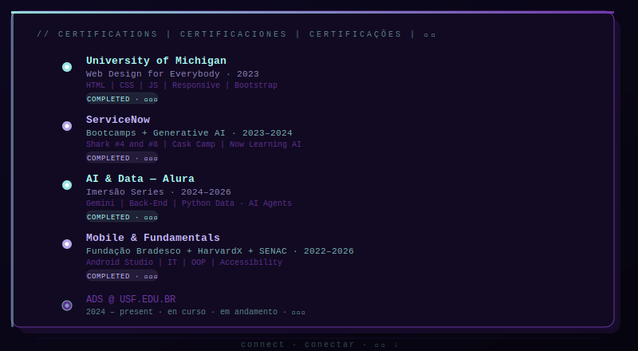

<!-- ═══════════════════════════════════════════════════════════════════
     EDUARDO SOUZA RODRIGUES — GitHub Profile README
     All sections are animated SVGs → readable on any screen size.
     To use: copy this file + the assets/ folder into your profile repo.
     ═══════════════════════════════════════════════════════════════════ -->

<!-- ── BANNER ──────────────────────────────────────────────────────── -->

 

<!-- ── BADGES (shields.io — rendered natively, always mobile-safe) ── -->

  

<!-- ── ABOUT ───────────────────────────────────────────────────────── -->

  

<!-- ── STACK ───────────────────────────────────────────────────────── -->

  

<!-- ── GITHUB STATS (external API — scales via width=100%) ─────────── -->

 

  

<!-- ── PROJECTS ────────────────────────────────────────────────────── -->

  

<!-- ── CERTIFICATIONS ──────────────────────────────────────────────── -->

  

<!-- ── CONTRIBUTION SNAKE ──────────────────────────────────────────── -->
<picture>
  <source media="(prefers-color-scheme: dark)"
          srcset="https://raw.githubusercontent.com/eduardo2580/eduardo2580/output/github-contribution-grid-snake-dark.svg"/>
  <source media="(prefers-color-scheme: light)"
          srcset="https://raw.githubusercontent.com/eduardo2580/eduardo2580/output/github-contribution-grid-snake.svg"/>
  
</picture>

  

<!-- ── CONNECT / FOOTER ────────────────────────────────────────────── -->

